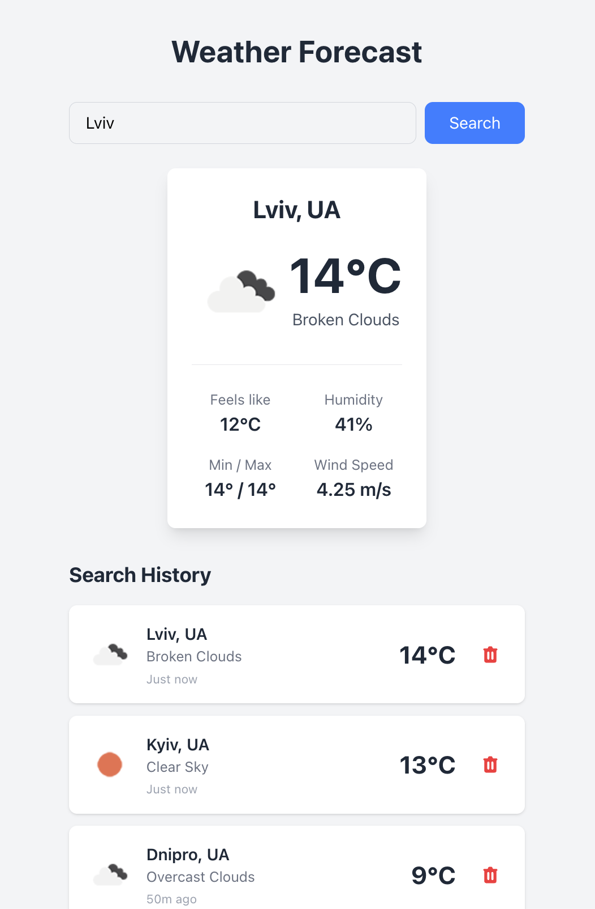

# Weather Forecast App

A production-ready weather forecast application built with React, TypeScript, and Tailwind CSS.



## Features

- **Weather Display** — Current temperature, description, min/max, wind speed, humidity, feels-like
- **Search History** — Persisted in localStorage with timestamps and weather snapshots
- **Click to Refresh** — Click any history item to re-fetch its weather data
- **Remove with Undo** — Delete history items with a 5-second undo window
- **Loading Skeletons** — Pulse-animated placeholders during API calls
- **Retry with Backoff** — Automatic retry (3 attempts) for transient network/server errors
- **Accessible** — Semantic HTML, ARIA labels, skip-to-content link
- **Code Splitting** — Lazy-loaded components for smaller initial bundle

## Getting Started

### Prerequisites

- Node.js 18+
- npm 9+

### Installation

```bash
npm install
```

### API Key Setup

This app uses the [OpenWeatherMap API](https://openweathermap.org/api) (free tier).

1. Copy the example environment file:
   ```bash
   cp .env.example .env
   ```
2. Replace the API key in `.env` with your own (or use the provided demo key):
   ```
   VITE_WEATHER_API_KEY=your_api_key_here
   VITE_WEATHER_API_URL=https://api.openweathermap.org/data/2.5
   ```

### Development

```bash
npm run dev
```

Opens the app at [http://localhost:5173](http://localhost:5173).

## Scripts

| Script                  | Description                         |
| ----------------------- | ----------------------------------- |
| `npm run dev`           | Start development server            |
| `npm run build`         | Type-check + production build       |
| `npm run preview`       | Preview production build locally    |
| `npm test`              | Run tests in watch mode             |
| `npm run test:coverage` | Run tests with coverage report      |
| `npm run test:ui`       | Open Vitest UI                      |
| `npm run lint`          | Run ESLint                          |
| `npm run lint:fix`      | Auto-fix ESLint issues              |
| `npm run format`        | Format code with Prettier           |
| `npm run build:analyze` | Build + open bundle size visualizer |

## Testing

```bash
# Run all tests
npm test

# Run with coverage (80% minimum threshold)
npm run test:coverage

# Run a specific test file
npx vitest run src/services/__tests__/weatherApi.test.ts
```

### Coverage Thresholds

| Metric     | Minimum |
| ---------- | ------- |
| Statements | 80%     |
| Branches   | 80%     |
| Functions  | 80%     |
| Lines      | 80%     |

## Architecture

```
src/
├── components/            # React components (memo-wrapped)
│   ├── SearchForm/        # City search input + submit
│   ├── WeatherCard/       # Weather data display + skeleton
│   ├── SearchHistory/     # History list with animated remove
│   └── UndoNotification/  # Toast with undo action
├── hooks/                 # Custom React hooks
│   ├── useWeatherApi      # Weather API state (fetch, loading, error)
│   ├── useSearchHistory   # History CRUD with localStorage
│   ├── useUndo            # Command-pattern undo with timeout
│   ├── useAnimatedRemove  # CSS animation + delayed removal
│   └── useDebounce        # Generic debounce utility
├── services/              # Business logic (no React)
│   ├── weatherApi.ts      # HTTP client with retry + caching
│   └── storage.ts         # localStorage abstraction
├── types/                 # TypeScript interfaces
│   ├── weather.ts         # API response & domain types
│   └── services.ts        # Service interfaces (DI contracts)
├── utils/                 # Pure utility functions
│   └── formatters.ts      # Time, temperature, icon helpers
├── config.ts              # Environment variable access
└── __tests__/             # Integration tests (App-level)
```

## Design Decisions

### SOLID Principles

- **Single Responsibility** — Each hook/component has one job (e.g., `useAnimatedRemove` only handles animation timing)
- **Open/Closed** — Utility functions (`formatters.ts`) extend formatting without modifying existing code
- **Dependency Inversion** — Hooks accept service interfaces via default parameters:
  ```ts
  useWeatherApi(service: IWeatherApiService = WeatherApiService)
  useSearchHistory(storage: IStorageService = StorageService)
  ```
- **Command Pattern** — `useUndo` creates `UndoCommand` objects with an `execute()` method for the undo action

### Error Handling Strategy

| Error Type         | Behavior                                                     |
| ------------------ | ------------------------------------------------------------ |
| Network failure    | Retry up to 3 times with exponential backoff (500ms, 1s, 2s) |
| 5xx server error   | Retry with backoff                                           |
| 429 rate limit     | Retry with backoff + "Too many requests" message             |
| 404 city not found | Immediate user-friendly error (no retry)                     |
| 401 unauthorized   | Immediate error (no retry)                                   |

### Performance Optimizations

- **React.memo** on all presentational components
- **useCallback** for all event handlers in App
- **React.lazy + Suspense** for WeatherCard, SearchHistory, UndoNotification
- **Code splitting** — React vendor chunk separated; lazy components in own chunks
- **Response caching** — 5-minute TTL cache in weatherApi service

### Accessibility

- Semantic HTML (`<header>`, `<main>`, `<section>`)
- ARIA labels on interactive elements and regions
- `aria-live="polite"` for dynamic weather results
- `role="alert"` for error messages
- Skip-to-content link for keyboard users
- `role="search"` on the search form

## Tech Stack

| Category   | Technology                     |
| ---------- | ------------------------------ |
| Framework  | React 19                       |
| Language   | TypeScript 5.9                 |
| Build Tool | Vite 8                         |
| Styling    | Tailwind CSS 4                 |
| Testing    | Vitest + React Testing Library |
| Linting    | ESLint 9 + Prettier            |
| Git Hooks  | Husky + lint-staged            |
| API        | OpenWeatherMap (free tier)     |
